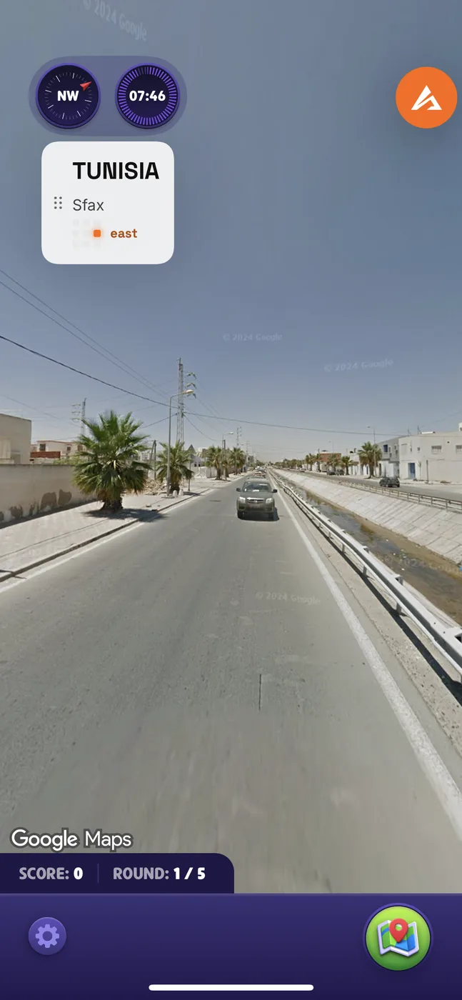
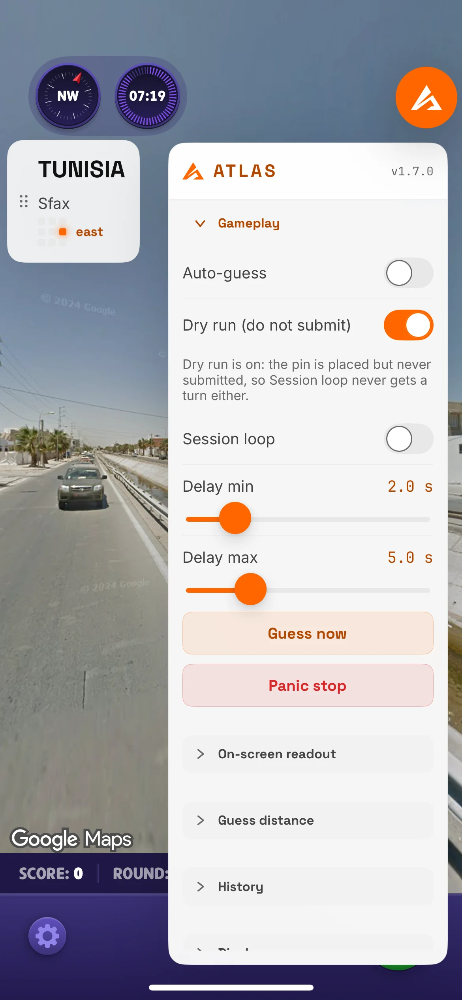

# GeoGuessr Hack for iPhone: the ATLAS IPA and On Screen Menu

  

  <b>A GeoGuessr hack that runs on the phone itself: an IPA you sideload, with an on screen menu during the round.</b> 
  Country, town and direction while you play, and it can place the guess for you. iPhone and iPad.

  
  
  
  
  
  

  <a href="https://github.com/Sven233333/Atlas-geoguessr-bot"><b>All platforms</b></a> &middot;
  <a href="https://geoguessrcheats.com/phone">Install guide</a> &middot;
  <a href="https://geoguessrcheats.com/repo">Jailbreak repo</a> &middot;
  <a href="https://github.com/Sven233333/atlas-geoguessr-android">Android</a>

For two years the answer to "does this work on my phone" was no. Since v1.7, in
August 2026, it is yes.

ATLAS runs as an app on iPhone and iPad. During a round it puts the country, the
town and the direction on screen, and it can place your guess for you. The key you
already own unlocks it, whether you bought it for the desktop app or the browser
extension.

Install instructions, step by step: **[geoguessrcheats.com/phone](https://geoguessrcheats.com/phone)**

---

## On screen during a round

A small readout, not a wall of text over your game:

- the country
- the town, so a country the size of Brazil is still a useful answer
- a direction
- an auto guess control, if you want the pin placed without touching the map
- a dry run mode, for watching what it would have done without doing it

## Getting it onto the phone

Apple does not have a store category for this, so installation goes the way most
sideloaded apps go. Five routes are documented, and the right one depends on what
you are willing to do to your phone:

| Route | Who it suits |
|---|---|
| SideStore | Most people. No jailbreak, no computer needed after setup. |
| Signulous or ESign | Paid signing services, least fiddly. |
| Sideloadly | You have a computer and do not mind refreshing the app. |
| Jailbroken | Already jailbroken: add the repository in Sileo, Zebra or Cydia. |
| Anything else | Covered on the install page, including what we will not support. |

Every one of them is written out with screenshots at
[geoguessrcheats.com/phone](https://geoguessrcheats.com/phone). If a route ever
stops working, that page is the one that gets corrected.

Jailbroken devices can add the repository directly:
[geoguessrcheats.com/repo](https://geoguessrcheats.com/repo).

## What it will not do on a phone

- It will not start matches and grind sessions while you sleep. That is a
  Windows job:
  [atlas-geoguessr-windows-app](https://github.com/Sven233333/atlas-geoguessr-windows-app).
- It has no free rounds. The seven free ones exist in the browser extensions, so
  try there first if you want to see predictions before paying:
  [Chrome](https://github.com/Sven233333/atlas-geoguessr-chrome-extension),
  [Firefox](https://github.com/Sven233333/atlas-geoguessr-firefox-addon).
- It does not sit on top of anything except your own game.

## Price

The same key as everything else: 14.99 euro monthly, 33.50 yearly, or 50 once and
never again. Nothing renews by itself.
[geoguessrcheats.com/plans](https://geoguessrcheats.com/plans)

## Questions people actually ask

**Do I need a jailbreak?**
No. Four of the five routes need nothing of the sort.

**Does it work on an iPad?**
Yes, the same app.

**Is it in the App Store?**
No, and it is not going to be.

**Will my phone battery survive it?**
The heavy part of the work does not happen on the phone.

**I bought a key months ago for the desktop app. Do I pay again?**
No. It unlocks this too.

**Is Android supported as well?**
Yes, since the same release:
[atlas-geoguessr-android](https://github.com/Sven233333/atlas-geoguessr-android).

## Around the rest of it

- Everything ATLAS runs on: [Atlas-geoguessr-bot](https://github.com/Sven233333/Atlas-geoguessr-bot)
- Side by side comparison: <https://geoguessrcheats.com/platforms>
- Release notes for v1.7: <https://geoguessrcheats.com/blog/atlas-v17-update/>

## Disclaimer

Independent project, no relationship with GeoGuessr AB or with Apple. Sideloading
and assistant use are your own decisions, and the rules of the game or ladder you
play in are worth reading first.
